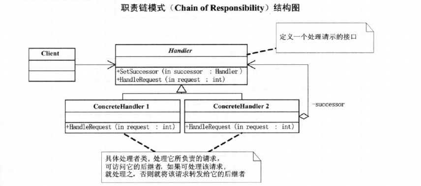

<h1 style="text-align: center;font-size:40px"> 责任链设计模式学习笔记 </h1>

# 一、简介

责任链模式：使多个对象都有机会处理请求，从而避免请求的发送者和接收者之间的耦合关系。将这个对象连成一条链，并沿着这条链传递请求，直到有一个对象处理它为止。



# 二、实现过程

## 1、Handler类

定义一个处理请示的接口

```c++
abstract class Handler
{
    protected Handler successor;

    // 设置继任者
    public void SetSuccessor(Handler successor)
    {
        this.successor = successor;
    }

    // 处理请求的抽象方法
    public abstract void HandleRequest(int request);

}
```

## 2、ConcreteHandler类

具体处理者类，处理它所负责的请求，可访问它的后继者，如果可处理该请求，就处理之，否则就将该请求转发给它的后继者

- ConcreteHandler1：当请求数在0-10之间，则有权处理，否则转到下一位

```c++
class ConcreteHandler1:Handler
{
    public override void HandleRequest(int request)
    {
        if(request >= 0 && request < 10)
        {
            // 0到10，处理此请求
            Console.WriteLine("{0}处理请求{1}", this.GetType().Name, request);
        }
        else if(successor != null)
        {
            // 转移到下一位
            successor.HandleRequest(request);
        }
    }

}
```

- ConcreteHandler2：当请求数在10-20之间，则有权处理，否则转到下一位

```c++
class ConcreteHandler2:Handler
{
    public override void HandleRequest(int request)
    {
        if(request >= 10 && request < 20)
        {
            // 0到10，处理此请求
            Console.WriteLine("{0}处理请求{1}", this.GetType().Name, request);
        }
        else if(successor != null)
        {
            // 转移到下一位
            successor.HandleRequest(request);
        }
    }

}
```
## 3、客户端代码

向链上的具体处理者对象提交请求

```c++
static void Main(string[] args)
{
    Handle h1 = new ConcreteHandler1();
    Handle h2 = new ConcreteHandler2();
    Handle h3 = new ConcreteHandler3();
}
// 设置职责链上家与下家
h1.SetSuccessor(h2);
h2.SetSuccessor(h3);

int[] requests = {2, 5, 14， 22， 18， 3， 27. 20};

// 循环给最小处理者提交请求，不同的数额，由不同权限处理者处理
forreach(int request in requests)
{
    h1.HandleRequest(request);
}

Console.Read();


```


# 三、职责链的好处

- 当客户提交一个请求时，请求是沿链传递直至有一个ConcreateHandler对象负责处理它

- 降低耦合度：职责链可简化对象的相互连接


# 一、申请

申请包括申请类别、申请内容、申请数量

```c++
class Request
{
  // 申请类别

  // 申请内容

  // 数量

}
```

# 二、申请处理
申请处理时，需要做出判断，是否有权决策

```c++
// 管理者
class Manager
{
  // 得到结果

}

// 客户端代码

```

