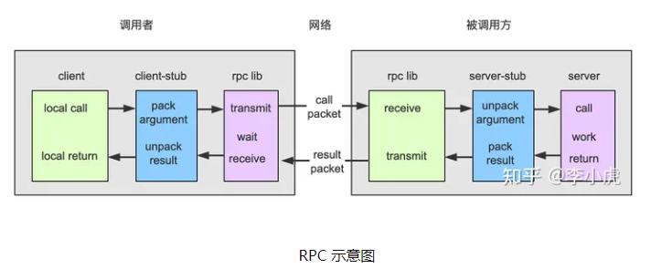

<h1 style="text-align: center;font-size:40px"> grpc笔记 </h1>

# 一、简介

## 1、grpc

gRPC 是Google公司开发的一个高性能、开源和通用的 RPC 框架，面向移动和 HTTP/2 设计。

## 2、Rpc基本概念
　　RPC（Remote Procedure Call）远程过程调用，是一种通过网络从远程计算机程序上请求服务，而不需要了解底层网络技术的协议，简单的理解是一个节点请求另一个节点提供的服务。RPC只是一套协议，基于这套协议规范来实现的框架都可以称为 RPC 框架，比较典型的有 Dubbo、Thrift 和 gRPC。

## 3、RPC 机制和实现过程
　　　　RPC 是远程过程调用的方式之一，涉及调用方和被调用方两个进程的交互。因为 RPC 提供类似于本地方法调用的形式，所以对于调用方来说，调用 RPC 方法和调用本地方法并没有明显区别。

# 二、RPC机制

当客户端发送请求的网络消息到达服务器时，服务器上的网络服务将其传递给服务器存根（server-stub）。服务器存根与客户端存根一一对应，是远程方法在服务端的体现，用来将网络请求传递来的数据转换为本地过程调用。服务器存根一般处于阻塞状态，等待消息输入。

　　　　当服务器存根收到网络消息后，服务器将方法参数从网络消息中提取出来，然后以常规方式调用服务器上对应的实现过程。从实现过程角度看，就好像是由客户端直接调用一样，参数和返回地址都位于调用堆栈中，一切都很正常。实现过程执行完相应的操作，随后用得到的结果设置到堆栈中的返回值，并根据返回地址执行方法结束操作。以 read 为例，实现过程读取本地文件数据后，将其填充到 read 函数返回值所指向的缓冲区。

　　　　read 过程调用完后，实现过程将控制权转移给服务器存根，它将结果（缓冲区的数据）打包为网络消息，最后通过网络响应将结果返回给客户端。网络响应发送结束后，服务器存根会再次进入阻塞状态，等待下一个输入的请求。

　　　　客户端接收到网络消息后，客户操作系统会将该消息转发给对应的客户端存根，随后解除对客户进程的阻塞。客户端存根从阻塞状态恢复过来，将接收到的网络消息转换为调用结果，并将结果复制到客户端调用堆栈的返回结果中。当调用者在远程方法调用 read 执行完毕后重新获得控制权时，它唯一知道的是 read 返回值已经包含了所需的数据，但并不知道该 read 操作到底是在本地操作系统读取的文件数据，还是通过远程过程调用远端服务读取文件数据。

## 2、执行步骤

- 1. 调用客户端句柄，执行传递参数。

- 2. 调用本地系统内核发送网络消息。

- 3. 消息传递到远程主机，就是被调用的服务端。

- 4. 服务端句柄得到消息并解析消息。

- 5. 服务端执行被调用方法，并将执行完毕的结果返回给服务器句柄。

- 6. 服务器句柄返回结果，并调用远程系统内核。

- 7. 消息经过网络传递给客户端。

- 8. 客户端接受数据。

## 3、RPC框架的组成

一个完整的 RPC 框架包含了服务注册发现、负载、容错、序列化、协议编码和网络传输等组件。不同的 RPC 框架包含的组件可能会有所不同，但是一定都包含 RPC 协议相关的组件，RPC 协议包括序列化、协议编解码器和网络传输栈，如下图所示：

## 4、rpc包的调用

RPC过程调用实现起来非常简单。服务端只需实现对外提供的远程过程方法和结构体，然后将其注册到 RPC 服务中，客户端就可以通过其服务名称和方法名称进行 RPC 方法调用。

# 三、GRPC
## 1、gRPC特点
　　 在gRPC的客户端应用可以想调用本地对象一样直接调用另一台不同的机器上的服务端的应用的对象或者方法，这样在创建分布式应用的时候更容易。下面看看gRPC的特点：
- 1. 语言无关，支持多种语言；
- 2. 基于 IDL 文件定义服务，gRPC使用protocol buffer 作为接口定义语言（IDL）来描述服务接口和有效负载消息的结构。通过 proto3 工具生成指定语言的数据结构、服务端接口以及客户端 Stub。
- 3. 通信协议基于标准的 HTTP/2 设计，支持双向流、消息头压缩、单 TCP 的多路复用、服务端推送等特性，这些特性使得 gRPC 在移动端设备上更加省电和节省网络流量；
- 4. 序列化支持 PB（Protocol Buffer）和 JSON，PB 是一种语言无关的高性能序列化框架，基于 HTTP/2 + PB, 保障了 RPC 调用的高性能。

## 2、gRPC使用说明

　　　　gRPC使用和上面RPC使用方法类似，首先定义服务，指定其能够被远程调用的方法，包括参数和返回类型，这里使用protobuf来定义服务。在服务端实现定义的服务接口，并运行一个gRPC服务器来处理客户端调用。

## 3、gRPC四种通信方式

　　 gRPC 允许你定义四类服务方法:

　　 1. 简单RPC（Simple RPC）：即客户端发送一个请求给服务端，从服务端获取一个应答，就像一次普通的函数调用。

rpc SayHello(HelloRequest) returns (HelloResponse){ }

　　 2. 服务端流式RPC（Server-side streaming RPC）：一个请求对象，服务端可以传回多个结果对象。即客户端发送一个请求给服务端，可获取一个数据流用来读取一系列消息。客户端从返回的数据流里一直读取直到没有更多消息为止。

rpc LotsOfReplies(HelloRequest) returns (stream HelloResponse){ }

　 3. 客户端流式RPC（Client-side streaming RPC）：客户端传入多个请求对象，服务端返回一个响应结果。即客户端用提供的一个数据流写入并发送一系列消息给服务端。一旦客户端完成消息写入，就等待服务端读取这些消息并返回应答。

rpc LotsOfGreetings(stream HelloRequest) returns (HelloResponse) { }

　　 4. 双向流式RPC（Bidirectional streaming RPC）：结合客户端流式rpc和服务端流式rpc，可以传入多个对象，返回多个响应对象。即两边都可以分别通过一个读写数据流来发送一系列消息。这两个数据流操作是相互独立的，所以客户端和服务端能按其希望的任意顺序读写，例如：服务端可以在写应答前等待所有的客户端消息，或者它可以先读一个消息再写一个消息，或者是读写相结合的其他方式。每个数据流里消息的顺序会被保持。

rpc BidiHello(stream HelloRequest) returns (stream HelloResponse){ }