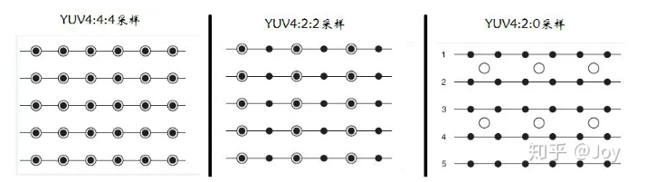

<h1 style="text-align: center;font-size:40px"> yuv笔记 </h1>

# 一、简介

YUV格式有两大类：planar和packed。

对于planar的YUV格式，先连续存储所有像素点的Y，紧接着存储所有像素点的U，随后是所有像素点的V。

对于packed的YUV格式，每个像素点的Y,U,V是连续交*存储的。

YUV，分为三个分量，“Y”表示明亮度（Luminance或Luma），也就是灰度值；而“U”和“V” 表示的则是色度（Chrominance或Chroma），作用是描述影像色彩及饱和度，用于指定像素的颜色。

## 1、yuv

用三个图来直观地表示采集的方式吧，以黑点表示采样该像素点的Y分量，以空心圆圈表示采用该像素点的UV分量。

- YUV 4:4:4采样，每一个Y对应一组UV分量。
- YUV 4:2:2采样，每两个Y共用一组UV分量。
- YUV 4:2:0采样，每四个Y共用一组UV分量。

## 2、字节数大小

- YUV444 Y 1 U 1 V 1 3字节
- YUV422 Y 1 U 1/2 V 1/2 2字节
- YUV420 Y 1 U 1/4 V 1/4 1.5字节

